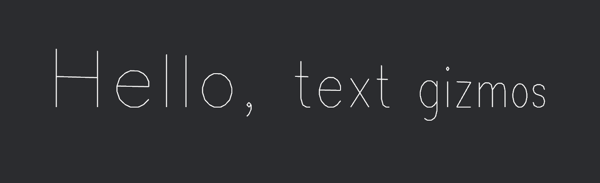
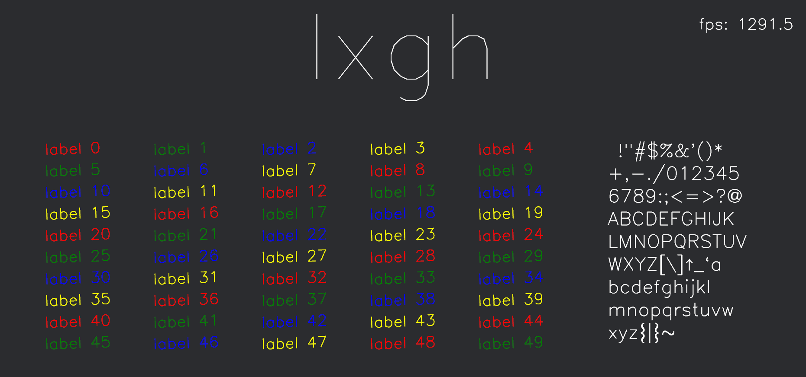
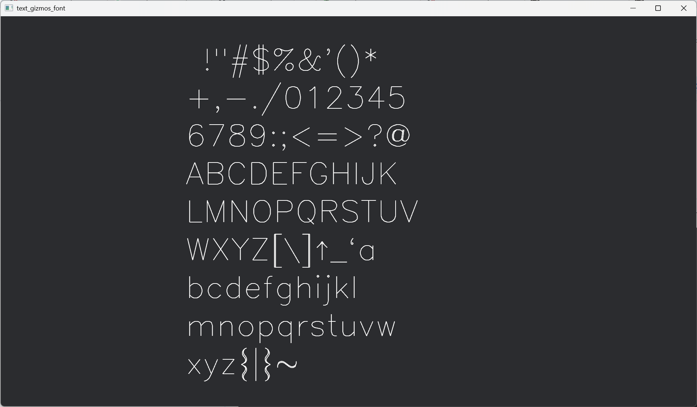

# bevy_text_gizmos

Text gizmo implementation for Bevy using stroke fonts.

## Usage

Add the depedency to the dependencies section of your project's `cargo.toml`:
```
bevy_text_gizmos = "0.2"
```

Then just import the `TextGizmos` trait: 

```rust
use bevy::prelude::*;
use bevy_text_gizmos::TextGizmos;

fn system(mut gizmos: Gizmos) {    
    gizmos.text(Isometry3d::IDENTITY, "text gizmo", 25.0, Vec2::ZERO, Color::WHITE);
}
```

## Examples

```
cargo run --example hello_gizmos
```



```
cargo run --example stress_text
```



```
cargo run --example all_glyphs
```




